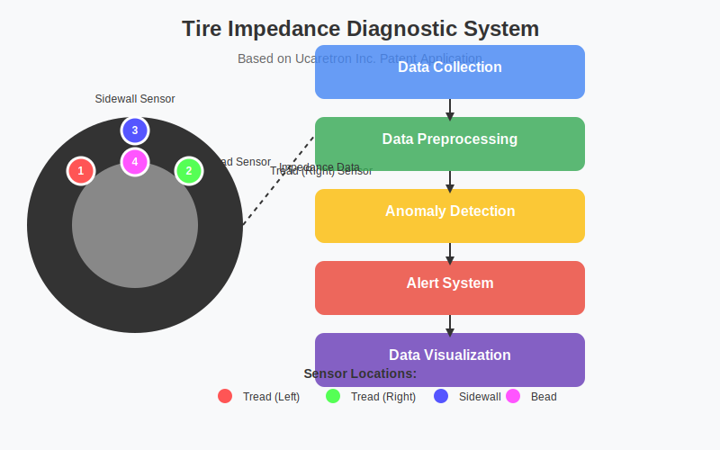

# Tire Condition Diagnostic System Using Impedance Measurement



This project implements a simulation of a tire condition diagnostic system that uses impedance measurement as described in Ucaretron Inc.'s patent application. The system simulates sensors placed within a tire to detect wear, structural damage, and other potential issues in real-time.

## 🌟 Features

- **Multi-point Impedance Sensing**: Simulates 4 impedance sensors at different tire locations (tread left/right, sidewall, and bead)
- **Dynamic Impedance Analysis**: Detects changes in impedance during operation
- **AI-based Failure Prediction**: Uses pattern analysis to predict tire failures
- **Temperature Compensation**: Adjusts impedance readings based on temperature
- **Real-time Visualization**: Presents tire condition through intuitive visualizations
- **Web-based Interface**: Interactive dashboard for simulation and monitoring
- **Docker Support**: Easy deployment using Docker containers

## 📊 System Architecture


The system consists of several integrated modules:

1. **Data Collection**: Simulates impedance sensors collecting data at configurable intervals
2. **Data Preprocessing**: Filters noise and applies temperature compensation
3. **Anomaly Detection**: Identifies abnormal impedance patterns using statistical analysis
4. **Alert System**: Generates warnings based on detected anomalies
5. **Visualization**: Creates visual representations of tire condition

## 🚀 Getting Started

### Prerequisites

- Python 3.8+
- Required libraries: NumPy, Pandas, Matplotlib, Scikit-learn, Flask
- Docker (optional, for containerized deployment)

### Installation

#### Method 1: Direct Python Installation

1. Clone the repository:
```bash
git clone https://github.com/JJshome/tire-impedance-diagnostic.git
cd tire-impedance-diagnostic
```

2. Install required dependencies:
```bash
pip install -r requirements.txt
```

3. Run the web application:
```bash
python app.py
```

The web interface will be available at http://localhost:8080

#### Method 2: Docker Installation (Recommended)

1. Clone the repository:
```bash
git clone https://github.com/JJshome/tire-impedance-diagnostic.git
cd tire-impedance-diagnostic
```

2. Build and run with Docker Compose:
```bash
docker-compose up -d
```

The web interface will be available at http://localhost:8080

## 💻 Web Interface

The system includes a fully interactive web interface for running simulations and visualizing results:

1. Open your browser and navigate to http://localhost:8080
2. Configure simulation parameters:
   - Interval: Time between readings (seconds)
   - Duration: Total simulation time (seconds)
   - Damage Time: When to apply damage (seconds)
   - Damage Type: Type of tire damage to simulate
3. Click "Start Simulation" to begin
4. Monitor real-time sensor readings and visualizations
5. Download reports and data for further analysis



## 🔄 Command-Line Usage

For automated testing or integration with other systems, you can also use the command-line tools:

### 1. Generate Simulation Data

Generate data for different tire conditions:

```bash
python generate_simulation_data.py --scenario sidewall_damage
```

Available scenarios:
- `normal`: Normal tire operation
- `gradual_wear`: Tire with gradual wear
- `sidewall_damage`: Tire with sidewall damage
- `tread_damage`: Tire with tread damage
- `puncture`: Tire with puncture

### 2. Analyze Data

Analyze simulation data to detect anomalies:

```bash
python analyze_simulation_data.py --latest
```

### 3. Run Real-time Simulation

Run a real-time simulation without web interface:

```bash
python tire_diagnostic_system.py --interval 5 --duration 60 --damage-time 30 --damage-type sidewall
```

## 📈 Visualization Outputs

The system generates two main types of visualizations:

### Tire Status Visualization

Shows the current state of the tire with sensor readings and alerts:


### Impedance Readings Plot

Displays time-series data of impedance readings from all sensors:



## 🔧 Advanced Configuration

### Docker Environment Variables

When running with Docker, you can configure the application using environment variables in the `docker-compose.yml` file:

```yaml
environment:
  - DEBUG=True  # Enable debug mode
  - PORT=8080   # Change port number
```

### Customizing Simulation Parameters

You can adjust various simulation parameters in the source code:

- Sensor count and placement: Modify `sensor_simulation.py`
- Alert thresholds: Modify `anomaly_detection.py`
- Visualization settings: Modify `data_visualization.py`

### Deploying to Production

For production deployments, we recommend:

1. Using Docker for containerization
2. Setting up a reverse proxy (Nginx or Traefik) for HTTPS support
3. Implementing proper access control if exposing the application publicly

## 📋 Sample Output

The system generates diagnostic reports with:
- Anomaly detection results
- Alert details and confidence levels
- Maintenance recommendations
- Time-based analysis

Example report snippet:
```
TIRE MAINTENANCE REPORT
Generated: 2025-05-07 08:12:34
Total alerts: 3

Alert Statistics:
- SIDEWALL_DAMAGE: 2 alerts
- ACCELERATED_WEAR: 1 alert

Maintenance Recommendations:
- URGENT: Immediate tire replacement recommended
- Wheel alignment check recommended
```

## 🛠️ Project Structure

```
tire-impedance-diagnostic/
├── app.py                      # Web application main file
├── analyze_simulation_data.py  # Data analysis script
├── generate_simulation_data.py # Data generation script
├── tire_diagnostic_system.py   # CLI simulation system
├── sensor_simulation.py        # Sensor data simulation
├── data_preprocessing.py       # Data preprocessing module
├── anomaly_detection.py        # Anomaly detection algorithms
├── alert_system.py             # Alert generation system
├── data_visualization.py       # Visualization components
├── templates/                  # HTML templates
│   └── index.html              # Web interface template
├── static/                     # Static web assets
│   ├── css/                    # CSS styles
│   └── js/                     # JavaScript files
├── assets/                     # Documentation assets
│   └── readme_images/          # Images for README
├── data/                       # Generated data storage
├── output/                     # Reports and outputs
├── Dockerfile                  # Docker configuration
├── docker-compose.yml          # Docker Compose configuration
├── requirements.txt            # Python dependencies
└── README.md                   # Documentation
```

## 🔍 Technical Details

### Impedance Measurement Principle

The system measures changes in electrical impedance within the tire structure. As tires wear or develop structural issues, the electrical resistance properties change in measurable ways:

- **Tread Wear**: Gradual increase in impedance as rubber thins
- **Sidewall Damage**: Sharp impedance changes in sidewall sensors
- **Punctures**: Sudden impedance spikes at specific locations
- **Temperature Effects**: Compensated impedance calculations based on heat

### AI-based Analysis

The anomaly detection system employs several techniques:
- Statistical thresholds for real-time detection
- Rate-of-change analysis for wear monitoring
- Pattern recognition for trend analysis
- Comparative algorithms for uneven wear detection

### Web Implementation

The web interface is built using:
- **Backend**: Flask (Python web framework)
- **Frontend**: HTML5, CSS3, JavaScript (with jQuery)
- **Visualization**: Matplotlib (for image generation)
- **Real-time Updates**: AJAX polling for dynamic updates

## 🌐 Online Demo

An online demonstration is available at: [https://tire-diagnostic-demo.example.com](https://tire-diagnostic-demo.example.com) (Note: This is a placeholder URL for illustration purposes)

## 🔄 Continuous Development

This project is actively developed with regular updates:

- Improved sensor simulation algorithms
- Enhanced visualization capabilities
- Additional damage scenarios
- Machine learning model improvements

## 🔮 Future Enhancements

Planned future enhancements include:

- **Enhanced ML Models**: More sophisticated AI models for anomaly detection
- **3D Visualizations**: Interactive 3D tire model with real-time status
- **Mobile Interface**: Responsive design for mobile devices
- **API Integration**: REST API for integration with other systems
- **Multi-tire Support**: Simultaneous monitoring of multiple tires

## 🛈 Patent Information

This implementation is based on a patent application by Ucaretron Inc. titled "Tire Condition Diagnostic System and Method Using Impedance Measurement." This simulation is for educational and demonstration purposes only.

## 📄 License

This project is licensed under the MIT License - see the [LICENSE](LICENSE) file for details.

## 🙏 Acknowledgments

- Ucaretron Inc. for the innovative patent application
- The Python scientific community for providing excellent tools
- Contributors to the open-source libraries used in this project
