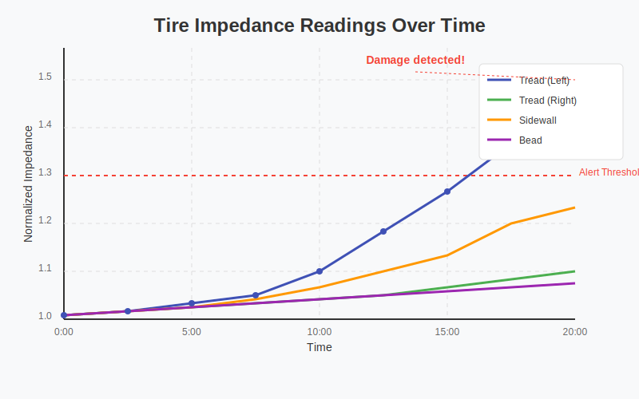

# Tire Condition Diagnostic System Using Impedance Measurement


This project implements a simulation of a tire condition diagnostic system that uses impedance measurement as described in Ucaretron Inc.'s patent application. The system simulates sensors placed within a tire to detect wear, structural damage, and other potential issues in real-time.

## 🌟 Features

- **Multi-point Impedance Sensing**: Simulates 4 impedance sensors at different tire locations (tread left/right, sidewall, and bead)
- **Dynamic Impedance Analysis**: Detects changes in impedance during operation
- **AI-based Failure Prediction**: Uses pattern analysis to predict tire failures
- **Temperature Compensation**: Adjusts impedance readings based on temperature
- **Real-time Visualization**: Presents tire condition through intuitive visualizations

## 📊 System Architecture


The system consists of several integrated modules:

1. **Data Collection**: Simulates impedance sensors collecting data at configurable intervals
2. **Data Preprocessing**: Filters noise and applies temperature compensation
3. **Anomaly Detection**: Identifies abnormal impedance patterns using statistical analysis
4. **Alert System**: Generates warnings based on detected anomalies
5. **Visualization**: Creates visual representations of tire condition

## 🚀 Getting Started

### Prerequisites

- Python 3.8+
- Required libraries: NumPy, Pandas, Matplotlib, Scikit-learn

### Installation

1. Clone the repository:
```bash
git clone https://github.com/JJshome/tire-impedance-diagnostic.git
cd tire-impedance-diagnostic
```

2. Install required dependencies:
```bash
pip install -r requirements.txt
```

### Running the System

The project includes a user-friendly interface for running the complete diagnostic workflow:

```bash
python run_diagnostic.py
```

This will open an interactive menu that allows you to:
- Generate simulation data for different scenarios
- Analyze tire impedance data
- Run real-time diagnostic simulations
- View results and visualizations

## 🔄 Workflow Examples

### 1. Generate Simulation Data

Generate data for different tire conditions:

```bash
python generate_simulation_data.py --scenario sidewall_damage
```

Available scenarios:
- `normal`: Normal tire operation
- `gradual_wear`: Tire with gradual wear
- `sidewall_damage`: Tire with sidewall damage
- `tread_damage`: Tire with tread damage
- `puncture`: Tire with puncture

### 2. Analyze Data

Analyze simulation data to detect anomalies:

```bash
python analyze_simulation_data.py --latest
```

### 3. Run Full Simulation

Run a real-time simulation:

```bash
python tire_diagnostic_system.py --interval 5 --duration 60 --damage-time 30 --damage-type sidewall
```

## 📈 Visualization Outputs

The system generates two main types of visualizations:

### Tire Status Visualization

Shows the current state of the tire with sensor readings and alerts:


### Impedance Readings Plot

Displays time-series data of impedance readings from all sensors:



## 📋 Sample Output

The system generates diagnostic reports with:
- Anomaly detection results
- Alert details and confidence levels
- Maintenance recommendations
- Time-based analysis

Example report snippet:
```
TIRE MAINTENANCE REPORT
Generated: 2025-05-07 08:12:34
Total alerts: 3

Alert Statistics:
- SIDEWALL_DAMAGE: 2 alerts
- ACCELERATED_WEAR: 1 alert

Maintenance Recommendations:
- URGENT: Immediate tire replacement recommended
- Wheel alignment check recommended
```

## 🔧 Customization

You can customize various parameters in the simulation:

- Sensor count and placement
- Sampling interval
- Alert thresholds
- Damage scenarios
- Visualization options

## 🛈 Patent Information

This implementation is based on a patent application by Ucaretron Inc. titled "Tire Condition Diagnostic System and Method Using Impedance Measurement." This simulation is for educational and demonstration purposes only.

## 🔍 Technical Details

### Impedance Measurement Principle

The system measures changes in electrical impedance within the tire structure. As tires wear or develop structural issues, the electrical resistance properties change in measurable ways:

- **Tread Wear**: Gradual increase in impedance as rubber thins
- **Sidewall Damage**: Sharp impedance changes in sidewall sensors
- **Punctures**: Sudden impedance spikes at specific locations
- **Temperature Effects**: Compensated impedance calculations based on heat

### AI-based Analysis

The anomaly detection system employs several techniques:
- Statistical thresholds for real-time detection
- Rate-of-change analysis for wear monitoring
- Pattern recognition for trend analysis
- Comparative algorithms for uneven wear detection

## 📄 License

This project is licensed under the MIT License - see the [LICENSE](LICENSE) file for details.
